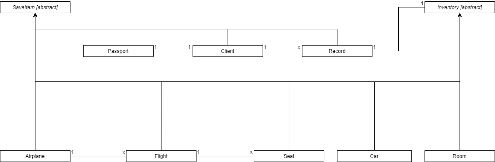
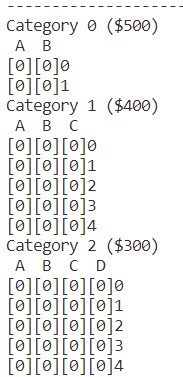
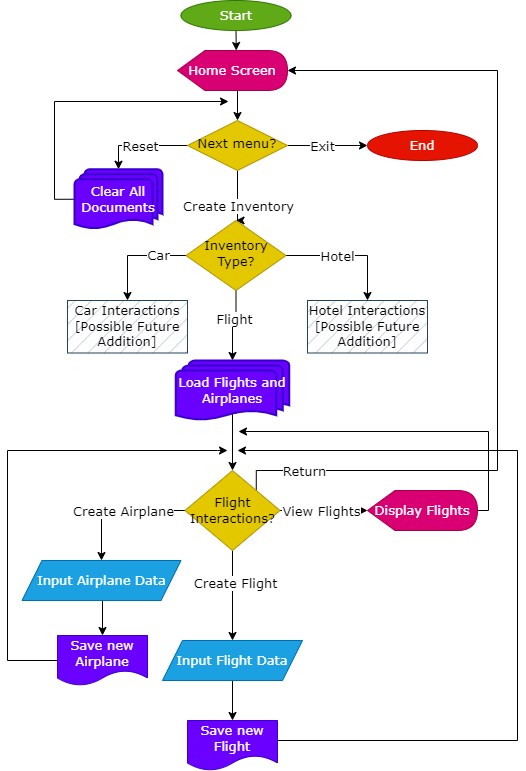
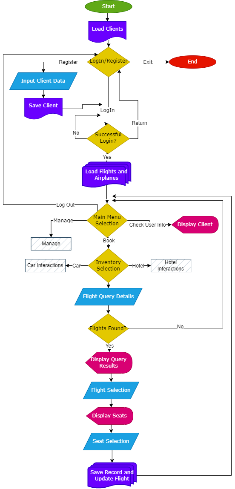

# Airline Reservation System Report

## Introduction

Airline reservation systems (ARS) are systems responsible for handling the creation and booking of airline _inventory_. While the most important category of inventory sold by airlines is seats on flights, inventory is any kind of product offered by the airline which often includes booking packages such as hotel and car rental options along with flights. Like any booking system, ARS not only handle the creation of inventory items, but also the creation and handling of users and their bookings. As a result, functionalities of ARS involve displaying and creating Airline schedules, managing fare tariffs, creating and creating records of passenger reservations. Those records are called _Passenger Name Records_ (PNRs), as the act as proof of a transaction attached to a specific person to link them to the purchased inventory. Since ARSs of different airliens need to interact with each other, ARSs also need to interface with the _Global Distribution System_ (GDS) which is a system that facilitates the creation of reservations by travel agencies and other distribution channels in making for most major airlines within a single system. [[1]](https://www.systrixit.com/airline-reservation-system-you-need-to-know/) [[3]](https://www.siteminder.com/r/global-distribution-system/) 

A PNR needs information such as passenger name, contact details, inventory details (itinerary), but can often include additional information beyond that such as fare details, tax amounts paid to the relevant authorities involved in the itinerary, the form of payment used, etc. Not to mention, governments often require that airlines include certain additional information in PNRs such as the passengers' gender, passport details (nationality, number, and date of expiry), and date and place of birth, among many other details. Regardless of the format of a PNR, the general purpose of creating said records and attaching them to the passengers they refer to is to allow for the exchange of reservation information in the case of _interlining_, or a passenger's need for flights of multiple airlines to reach their destination. The International Air Transport Association (IATA) has degined standards for interline messaging of PNR through the "ATA/IATA Reservations Interline Message Procedures - Passenger" (AIRIMP), yet, as previously mentioned, there are no set standards for the layout or content of a PNR. [[2]](https://www.altexsoft.com/blog/pnr-explained/)

## Approach

To make sure the project remains feasible, I set a certain list of expectations to frame my system within a useful, expandable, yet achievable system. My main hopes for the project are less the creation of a system that handles everything and more the implementation of an expandable and adaptable to design which is provided by the right combination of abstraction and other _Object Oriented Programming_ (OOP) principles (Abstraction, Encapsulation, Inheritance, and Polymorphism) [[7]](https://www.partech.nl/en/publications/2020/10/basic-principles-of-object-oriented-programming) .

The goals for the submittable portion of the project (the code) were to create an Airline reservation system for the fictitious _Mistika Airlines_ that has two interfaces as follows:

- Administrator interface:
    - Create Flights (and any other components necessary for flight creation).
        - Flights should be associated with airplanes
        - The number and category (e.g. first class, business class, etc) of each seat should be automatically generated based on the airplane.
        - The prices of each category should be definable by the administrator
    - View all created Flights
    - Clear all stored data (In case any error happens in the system)

- Client interface:
    - Create User (and all necessary user information such as Passport details) and login
    - Flight querying (search for all flights within a certain day)
    - Flight booking (which involves PNR creation)

While these basic functionalities don't necessitate some of the components described in the [following section](#solution), those parts were added to demonstrate the aforementioned expandability of the system to add functionalities as described in the [Future](#future) section.

Additionally, the two interfaces communicate through a local file system and thus necessitate save functionalities for most objects. For the sake of the challenge, I decided to implement RSA encryption/decryption. Any asymmetric encryption/decryption algorithm like RSA involves a public and a private key. In RSA, the public key is (n,e), where n = p * q, p and q being primes, and e is an invertible integer modulo Φ(n). Modulo (mod) refers to the act of taking the remainder of a number when divided by another, and thus modulo Φ(n) is a group of elements between 0 and Φ(n)-1. Evaluating a modulo b is often shorthanded to a[b]. Some of those elements are invertible, which is to say, if e is invertible mod Φ(n), then there exists an integer d such that e * d evaluates to 1[Φ(n)]. To get the private key of our encryption, we need to evaluate Φ(n), which is the number of invertible elements mod n which evaluates to Φ(n) = (p-1)(q-1), and find d such that d is the inverse of e mod Φ(n). Once those elements are all met, the encryption/decryption proceeds as follows:

- Encryption: 
    Bob wants to send Alice an encoded message M. Bob has access to Alice's public key only (n,e). Bob computes C = M^e [n]. Bob sends Alice C.

- Decryption:
    To decrypt the message C, Alice uses her private key (n,d). Alice computes C^d [n] = (M^e)^d [n] = M^(ed) [n]. ed = 1[Φ(n)] since d is the inverse of e, which means that there exists an integer k such that ed = kΦ(n) + 1. Substituting in the previous equation, C^d[n] = M^(kΦ(n) + 1)[n] = (M^Φ(n))^k * M[n] and by Euler's theorem M^Φ(n) = 1[n], we conclude that C^d[n] = (M^Φ(n))^k * M[n] = 1^k * M[n] = M[n] which is the original message.

Additionally, there needs to be an encoding scheme (how to turn string information to integers). I decided to take each character in a string sequence and convert it to its ASCII character as my encoding scheme. To represent the 128 possible ASCII characters, n must be greater that 128. Finally, I list my choice of values for p, q, n (= p * q), e, and d:

- p = 23
- q = 29
- n = 23*29 = 667
- e = 3
- d = 411

[[4]](https://www.geeksforgeeks.org/rsa-algorithm-cryptography/) [[5]](https://www.gcsu.edu/sites/files/page-assets/node-808/attachments/maxey.pdf)

With this out of the way, the logic of everything in the program should become clear in the [following section](#solution).

## Solution

### __(a) General Structure__



The simplified class diagram above represents the general structure of the entire system. There are two main superclasses, Inventory and SaveItem, and multiple interacting components. The major interactions of the program are:

- Flight creation and management
- Client creation and management
- Flight booking and Record creation
- Saving and reading entities into/from files 

 The following sections will explain all these classes and interactions in detail.

### __(b) Inventory__

As explained in the [introduction](#introduction), inventory refers to any service or product sold by the airline through the ARS. In my code, I define the _abstract_ superclass __Inventory__ to define the necessary attributes and functionalities (including abstract ones) for the creation of an Inventory subclass (e.g. Seat, Car, and Room). An abstract class in c++ refers to an incomplete class which has at least one purely virtual function, which means that one of its functions does not have a definition in the abstract class. The only restriction (as far as I've seen) on purely virtual functions is that they cannot be static, and they can therefore can have any return type or argument number/type. If a class is to inherit from an abstract class, it must implement all its putely virtual functions lest it becomes an abstract class as well. Objects cannot be created of abstract classes as they are incomplete, and therefore abstract classes can be seen as blueprint for the creation of other classes. While purely virtual functions and abstract classes weren't covered in lecture, they can be considered an application of the OOP principle of abstraction [[6]](https://www.simplilearn.com/tutorials/cpp-tutorial/abstract-class-in-cpp#:~:text=An%20abstract%20class%20in%20C%2B%2B,class%20in%20its%20own%20right.). Additionally, the creation and inheritence of the superclass Inventory is an application of the OOP principles of encapsulation and inheritence. The way to perform that in c++ is by creating a purely virtual function as follows:

```c++

class Inventory {

    /*
    Other Attributes and functions
    */

    virtual void print_details() = 0; // purely virtual function of void return type

    virtual bool Reserve() = 0; // purely virtual function of default variable (bool) return type
    
    // purely virtual function of object return type with arguments
    virtual Record Purchase(Client* client, tm reservation_date) = 0;

};

```

As shown above, there are three purely virtual functions print_details(), Reserve(), and Purchase() whose names are self explanable. As for the attributes, there are two protected members ID and price which are necessary attributes for any inventory item. The inheritence of the inventory class is demonstrated later.

### __(c) Records__

The creation of PNRs is handled by the __Record__ class, which is in a one to many relationship with Clients and one to one relationship with inventory items (a client can make multiple reservations but each inventory item can be purchased once as I don't allow for overbooking). The information I decided to include in a PNR is the following:

- Record ID
- A pointer to the linked client
- A pointer to the linked inventory
- The reservation date

Instead of saving a copy of the client and inventory items linked to the record object, saving the pointers would reduce the memory usage and can therefore be considered an example of memory optimization. The Record ID is generated by the generateID() function which creates a sequential unique ID for each record by incrementing a static num_records counter. The reservation date is saved as a tm struct which has the relevant attributes (tm_mday, tm_mon, tm_year) for dates and (tm_hour, tm_min, tm_sec) for time creation.

In the record class, some functions need to take in a vector of object as an input. Instead of dealing with a copy of the vector, I send the vector by reference so as to optimize memory usage (and to make sure the pointers point to the correct object not the copy):

```c++ 
    class Record : ... {

        ...

        static Client* findClientfromID(string ID, vector<Client> &clients)

        vector<Record> Record::loadAll(vector<Client> &clients, vector<Inventory> &inventoryItems)

        Inventory* Record::findInventoryfromID(string ID, vector<Inventory> &inventoryItems)
    
    }

```

### __(d) Flights__

For creating flights, three classes have to work hand-in-hand: __Flight__, __Airplane__, and __Seat__. 

Any flight happens on an airplane, and thus the Airplane class is necessary to define the plane model and dimensions (how many columns and row it has in the first, business, etc. classes). Flights are created in association to one plane, while one plane can be assigned to many different flights. Therefore, as shown in the figure, the relationship between the Airplane and Flight classes is one to many in that order. The Airplane class has some basic functionalities such as constructors, setters, and getters.

The Flight class is used to generate seats based on the Airplane dimensions, as well as keeping record of all flight related information such as the origin airport, destination airport, departure date and time, arrival date and time, category price, etc. To create a flight, all the necessary information is taken in and used to create a 3D vector of seats or an array of 2D arrays of seats, one 2D array for each category as shown in the figure below (all the seats are filled with 0 indicating that they are free). Because indexing of vectors works in constant time and throughout my code I make extensive use of indexing, using vectors optimizes my time usage [[10]](https://stackoverflow.com/questions/42928989/constant-time-access-to-an-arbitrary-element-in-a-list-c#:~:text=std%3A%3Avector%20's%20element,time%20complexity%2C%20regardless%20of%20size.&text=If%20you%20rely%20on%20CPU,element%20differs%20from%20reading%20it.).

<p align="center">
  
</p>

The Seat class is the actual inventory item that can be purchased and have PNR records of. Therefore, the Seat class inherits from the abstract class [Inventory](#b-inventory). As a subclass of Inventory, it implements the purely virtual functions Purchase(), reserve(), and print_details(). The Purchase() function creates a successful record of the transaction if the reserve() function returns true (aka the item isn't already reserved), and returns a default record otherwise (which carries useless data). Seats are only created through the Flight class and populate the 3D Seat vector there. As mentioned earlier, inheritence is an example of an OOP concept.

### __(e) Clients__

 Inventory items are booked by Clients, and since this is an ARS, every client is linked to a uniquely to a Passport. Therefore, the __Client__ and __Passport__ classes are linked in a one to one relationship. Upon registering, clients are asked to input passport information which creates a passport object owned by the client, as well as user log in information (e.g. username, password, email, etc.). The client has the option to print his/her details. To log in, there is a validate function that returns the address of the client if the password is correct. 

 ```c++
    Client* validate(string pass) {
        if (pass == password)
            return this;
        return nullptr;
    }
```

### __(f) Saving__

All classes that have information necessary to be saved by the file system inherit from the abstract class __SaveItem__. The SaveItem class defines the necessary purely virtual function to save objects to files in the classes that inherit it, as well as private encryption and decryption methods for implementing RSA encryption on the data. To implement RSA efficiently, I included a function called fastExponentiation() which takes in b, e, and p and computes b^e[q] efficiently. It does that by multiplying by b e times, modding at each step. That way, numbers don't get big and unweildy, and there isn't a chance that integer overflow may happen and cause errors in encrypting/decrypting messages. Therefore, this is another optimization scheme.

```c++ 
    class SaveItem {
        private:
        static int n; // 667
        static int p; // 23
        static int q; // 29
        static int e; // 3
        static int d; // 411

        public:
        virtual bool save() = 0; // purely virtual function

        protected:
        static string encrypt(string message) {
            string encrypted = "";
            ...
            return encrypted;
        }

        static string decrypt(string message) {
            ...
            return decrypted;
        }

        static int fastExponentiation(int b, int e, int p) {
            int res = 1;
            for (int i = 0; i < e; i++) {
                res *= b;
                res %= p;
            }
            return res;
        }

    };
```

Classes that inherit from the SaveItem class are Client, Record, Airplane, Flight, and Seat. Inheritance, as mentioned earlier, is an OOP concept. The saving to and loading from files works mostly the same for all the classes and thus I will include only one example from the Client class below:

```c++

    // Saving a client object
    bool Client::save() {
        ofstream writer;
        writer.open(save_path, std::ios_base::app);
        if (writer.fail()) {
            cerr << "Error saving client..." << endl;
            writer.close();
            return false;
        }
        writer << encrypt(ID) << ',';
        writer << encrypt(name) << ',';
        writer << encrypt(passport.getID()) << ',';
        ... // Similarly for the other attributes
        writer << endl;
        writer.close();
        return true;
    }

    // Loading all the Client objects
    static vector<Client> loadAll() {
        vector<Client> clients;
        ifstream reader;
        reader.open(save_path);
        if (reader.fail()) {
            cerr << "Error loading clients..." << endl;
            reader.close();
            return vector<Client>();
        }
        string temp;
        num_clients = 0;
        while (getline(reader, temp)) {
            num_clients++;
            string ID, name, email, username, password, passport_ID;
            tm DoB, DoI, DoE;
            CountryEnum country;
            char type, sex;
            long phone;
            stringstream s_stream(temp);
            getline(s_stream, temp, ',');
            ID = decrypt(temp);
            cout << ID << endl;
            getline(s_stream, temp, ',');
            name = decrypt(temp);
            ... // Similary for the other attributes
            clients.push_back(Client(ID, name, Passport(passport_ID, type, name, country, DoB, DoI, DoE, sex), email, phone, username, password));
        }
        reader.close();
        return clients;
    }

```

There are a few variations between the classes but the most significant difference is in the Flight class, where it has a few more functionalities:

- Overwriting: When a seat is booked in a flight, the flight record in the save file needs to be updated. The way I have it implemented is by saving the old file in a vector then copying all the flights until the one I want to overwrite, at which point I call the save function to save the new state of the flight, then I continue saving the rest of the old file into the save file.

    ```c++

        bool OverwriteSave() {
            bool saved = false;
            vector<string> flights;
            ifstream reader;
            reader.open(save_path);
            if (reader.fail()) {
                cerr << "Error loading planes..." << endl;
                reader.close();
                return false;
            }
            string temp;
            // Save old file
            while(getline(reader, temp)) {
                flights.push_back(temp);
            }
            reader.close();
            ofstream writer;
            writer.open(save_path, ios::out | std::ofstream::trunc); // Clear the file
            if (writer.fail()) {
                cerr << "Error updating flights..." << endl;
                return false;
            }
            // Rewrite all the flight records except for the one with representing the calling Flight object
            // For the calling flight object, the save() function is called to reflect the new changes
            for (int i = 0; i < flights.size(); i++) {
                if (!saved) {
                    string temp2;
                    stringstream s_stream(flights[i]);
                    getline(s_stream, temp2, ',');
                    temp2 = decrypt(temp2);
                    if (temp2 == ID) {
                        writer.close();
                        save();
                        saved = true;
                        writer.open(save_path, ios::app);
                        if (writer.fail()) {
                            cerr << "Error updating flights..." << endl;
                            return false;
                        }
                        continue;
                    }
                }
                writer << flights[i] << endl;
            }
            writer.close();
            return true;
        }
    ```

- Turning the seat states into a string vector to save flights and the opposite way to load flights.

```c++ 
    // Turns the current reservation states of the seats to a string
    vector<string> getAllSeatStates() {
        vector <string> res;
        for (int i = 0; i < seats.size(); i++) {
            string str = "";
            for (int r = 0; r < seats[i].size(); r++) {
                for (int c = 0; c < seats[i][r].size(); c++) {
                    str += to_string(seats[i][r][c].getReserved());
                }
            }
            res.push_back(str);
        }
        return res;
    }

    // Takes in string vector to assign the seats
    void AssignSeatStatesfromStrings(vector<string> string_vec) {
        for (int i = 0; i < seats.size(); i++) {
            for (int r = 0; r < seats[i].size(); r++) {
                for (int c = 0; c < seats[i][r].size(); c++) {
                    if (string_vec[i][r*seats[i][r].size() + c] == '1') {
                        seats[i][r][c].Reserve();
                    }
                }
            }
        }
    }
```

### __(g) Interfaces__

There are two interfaces to the system, a client interface and an administrator interface. The file system operated by the SaveItem class and its subclasses is used to link those two interfaces. Each interface is encapsulated in a namespace with a bunch of nested namespace for all subinterfaces, and thus this is an example of OOP concepts. Additionally, I make extensive use of indexing collections throughout my interfaces and therefore I chose the vector collection type because of its constant time access, which optimizes time [[10]](https://stackoverflow.com/questions/42928989/constant-time-access-to-an-arbitrary-element-in-a-list-c#:~:text=std%3A%3Avector%20's%20element,time%20complexity%2C%20regardless%20of%20size.&text=If%20you%20rely%20on%20CPU,element%20differs%20from%20reading%20it.).

#### (i) Administrator Interface

<p align="center">
  
</p>

The above flow chart details all the interactions. Hatched blocks refer to possible future expansions.

#### (ii) Client Interface

<p align="center">
  
</p>

The above flow chart details all the interactions. Hatched blocks refer to possible future expansions.

### __(h) Enums and Conversions__

There are examples of data that can only be one of a finite number of options. To implement that functionality, I decided to use _Enumerations_ (Enum). Enums are used only when a variable can have one of the possible set of values [[8]](https://beginnersbook.com/2017/09/cpp-enumeration/#:~:text=Enums%20are%20used%20only%20when,variable%20that%20holds%20the%20direction.). In my system, examples of such instances are Airports, Countries, and Columns (in an Airplane). I copied lists online of all IATA airport codes and all countries (Countries with names longer than one word are separated by '_' in my code, and thus United_Arab_Emirates is valid input when United Arab Emirates isn't so please be careful of that in the input).

I encapsulate each Enum with its relevant functions (converting from string to enum and enum to string) in a namespace (another OOP concept). To convert between enums and strings, I have an intermediary array of strings (or a const char* array) that is sorted alphabetically in the same order as the Enums they stringify. To convert from the enum to the string, you only need to call the int casted enum indexed element (in the Column Enum, C maps to 2 and thus you would call the index 2 of the string array). The other way around is a bit more complicated. The string to convert is searched for in the array, and the index at which it occurs is cast to an Enum. Since the array is sorted, I decided to optimize run-time by using binary search. The idea of binary search, assuming the array is listed in ascending order, is to check the middle element of the array, check whether it is greater than or less than the element you are searching for. If it is greater, that indicates that the thing you are searching for is in the first half of the array. Otherwise, it is in the last half. Treat the half of the array that you decided on as the full array and repeat the process until you find the element or return when you don't. Binary search is more efficient as it is of the order  O(log n) whereas linear search is of the order O(n) [[9]](https://www.javatpoint.com/binary-search-in-cpp#:~:text=Steps%20to%20perform%20the%20binary,middle%20element%20of%20the%20array.). Therefore, this is considered an optimization strategy.

```c++
    Column binarySearch(string str, int low, int high) {
        if (low > high)
            return (Column) 0; 
        else {
            int mid = (low + high) / 2;
            if (str == Col_to_String((Column) mid))
                return (Column)mid;
            else if (str > Col_to_String((Column) mid))    // str is on the right side
                return binarySearch(str, mid + 1, high);
            else                        // str is on the left side
                return binarySearch(str, low, mid - 1);
        }
    }

```

Finally, I chose to make my Enum to string conversion inline for time optimization:

```c++
    inline string Col_to_String(Column col) {
        return col_to_string[(int)col];
    }
```

### __(e) (Re)highlighting OOP & Optimization Strategies__

In the previous sections, I highlighted the used OOP and optimization strategies. To shed more light on them, I decided to dedicate this section to reiterate on the approaches.

**Some Implemented Optimization Approaches**:

- *Concept #1*: [Passing by reference], *Record.h / 85-114*
- *Concept #2*: [Using the vector container class], *adminInterface.h / 9-12*
- *Concept #3*: [Using Pointers], *Record.h / 21,23*
- *Concept #4*: [Inline functions], *Column.h / 48-50*
- *Concept #5*: [Binary search in sorted lists], *Column.h / 57-69*
- *Concept #6*: [Fast Exponentiation], *SaveItem.h / 46-53*

**Some Implemented OOP Concepts**:

- *Concept #1*: [Abstract Classes/virtual functions], *File Name / Line Number(s)* : [Inventory.h / Entire File]
- *Concept #2*: [Classes], *File Name / Line Number(s)*: [Inventory.h, Client.h, etc. / Entire File]
- *Concept #3*: [Inheritence], *File Name / Line Number(s)*: [Seat.h / 11]
- *Concept #4*: [Namespaces], *File Name / Line Number(s)*: [clientInterface.cpp / 9-392]

## Output

### __(a) Admin Interface__

I will show the output of the path of creating a single airplane and flight

```console
------------------------------------------------------------------------
Welcome to Mistika Airways Computer Reservation System - Admin Interface
------------------------------------------------------------------------
Home screen
Enter the associated number for your choice:
0 - Create Inventory
1 - Reset All Files
2 - Exit
0
```

```console
------------------------------------------------------------------------
Select inventory type:
Enter the associated number for your choice:
0 - Flight
1 - Car
2 - Hotel
0
```

```console
------------------------------------------------------------------------
Flight Interactions
Enter the associated number for your choice:
0 - Add Airplanes
1 - Create Flights
2 - View Flights
3 - Return
0
```

```console
------------------------------------------------------------------------
Add Plane
~~~~~~~~~~~~~~~~~~~~~~~~~~~~~~~~~~~~~~~~~~~~~~~~~~~~~~~~~~~~~~~~~~~~~~~~
Model: Prof. Tuka's Private Jet
Number of categories (First class/Business Class/Economy Class etc.): 2
Enter row and column count for category 0: 2 2
Enter row and column count for category 1: 3 3
```

```console
------------------------------------------------------------------------
Flight Interactions
Enter the associated number for your choice:
0 - Add Airplanes
1 - Create Flights
2 - View Flights
3 - Return
1
```

```console
------------------------------------------------------------------------
Create Flight
~~~~~~~~~~~~~~~~~~~~~~~~~~~~~~~~~~~~~~~~~~~~~~~~~~~~~~~~~~~~~~~~~~~~~~~~
Plane selection: 
Enter the associated number for your choice and -1 to create plane...
0 - ID: 0 | Model: Prof. Tuka's Private Jet | Category count: 2
0
```

```console
------------------------------------------------------------------------
Create Flight
~~~~~~~~~~~~~~~~~~~~~~~~~~~~~~~~~~~~~~~~~~~~~~~~~~~~~~~~~~~~~~~~~~~~~~~~
Departure date and time GMT (hh:mm DD/MM/YYYY): 12:00 03/03/2023
Arrival date and time GMT (hh:mm DD/MM/YYYY): 14:00 03/03/2023
From (Airport Code): AUH
To (Airport Code): RUH
Price (in $) for category 0: 1000
Price (in $) for category 1: 900
```

```console
------------------------------------------------------------------------
Flight Interactions
Enter the associated number for your choice:
0 - Add Airplanes
1 - Create Flights
2 - View Flights
3 - Return
2
```

```console
------------------------------------------------------------------------
Created Flights
Flight: 0 | AUH (12:00 03/03/2023) --> RUH(14:00 03/03/2023)
Enter any number to return...
-1
```

returning, returning, then exiting...

```console
------------------------------------------------------------------------
Thanks for using our services...
@DoodyShark ➜ /workspaces/course-project-DoodyShark (main) $ 
```

### __(b) Client interface__

I am going to create a user, log in, and book 2 seats from the flight I just created above.

```console
---------------------------------------------------------
Welcome to Mistika Airways Computer Reservation System...
---------------------------------------------------------
Log in or Register
Enter the associated number for your choice:
0 - Log in
1 - Register
2 - Exit
1
```

```console
---------------------------------------------------------
Register
~~~~~~~~~~~~~~~~~~~~~~~~~~~~~~~~~~~~~~~~~~~~~~~~~~~~~~~~~
Passport details: 
Country: United_Arab_Emirates
Full name: Dhiyaa Al Jorf
Passport ID: T000000
Passport Type: P
Date of Birth (DD/MM/YYYY): 9/03/2004
Date of Issue (DD/MM/YYYY): 01/01/2021
Date of Expiry (DD/MM/YYYY): 01/01/2027
Sex: M
```
```console
Register
~~~~~~~~~~~~~~~~~~~~~~~~~~~~~~~~~~~~~~~~~~~~~~~~~~~~~~~~~
Username: User
Password: Pass
Email: email@mail.com
Phone number: 4533335623
```

```console
---------------------------------------------------------
Log in
Username: User
Password: Pa
~~~~~~~~~~~~~~~~~~~~~~~~~~~~~~~~~~~~~~~~~~~~~~~~~~~~~~~~~
Incorrect user details...
Enter 0 to retry, any other number else to return: 0
Username: User
Password: Pass
```

```console
---------------------------------------------------------
Home Screen
Enter the associated number for your choice:
0 - Book
1 - Manage
2 - Check user info
3 - Log Out
0
```

```console
---------------------------------------------------------
Booking Screen
Enter the associated number for your choice:
0 - Flights
1 - Car Rental
2 - Hotel Booking
3 - Return
0
```

```console
---------------------------------------------------------
One Way Flight
~~~~~~~~~~~~~~~~~~~~~~~~~~~~~~~~~~~~~~~~~~~~~~~~~~~~~~~~~
From (Airport Code): AUH
To (Airport Code): RUH
Departure Date (DD/MM/YYYY): 03/03/2023
```

```console
---------------------------------------------------------
Available Flights: 
0 - Flight: 0 | AUH (12:00 03/03/2023) --> RUH(14:00 03/03/2023)
0
```

```console
---------------------------------------------------------
Category 0 ($1000)
 A  B 
[0][0]0
[0][0]1
Category 1 ($900)
 A  B  C 
[0][0][0]0
[0][0][0]1
[0][0][0]2
Pick seat (e.g. 0 A 3): 1 B 1
```

Searching for the same flight again will show that the seat 1B1 is booked:

```console
---------------------------------------------------------
Category 0 ($1000)
 A  B 
[0][0]0
[0][0]1
Category 1 ($900)
 A  B  C 
[0][0][0]0
[0][1][0]1
[0][0][0]2
Pick seat (e.g. 0 A 3): 1 B 2
```

logging out and exiting...

```console
---------------------------------------------------------
Thanks for using our services...
@DoodyShark ➜ /workspaces/course-project-DoodyShark (main) $ 
```

## Future

### __(a) Car Rental and Hotels - Extending Inventory__

Currently, while the front-end and back-end modules for booking and creating other inventory items such as cars and hotels exist, I decided to focus on the flight reservation aspect and leave the other modules in the interface to prove the modularity and adaptability of the system without wasting the time creating interactions that weren't the main initial focus of the project (the prompt was flights reservation system).

### __(b) Record Management__

Currently, Records are created and saved onto the file system, but I haven't implemented functionalities to manage and view your bookings. That functionality can be added later in the future to allow for booking cancellations, adjustments, check-in, etc.

### __(c) Overbooking and Airplane Reassignment__

Many airlines overbook their flights to account for passengers that don't end up riding the planes. My current system doesn't implement that, though the way to go about it would be to create a fictitious additional category of seats that doesn't have an actual mapping onto the linked airplane when creating a flight. If a client wants to book a flight, they can choose not to specify their seat, and that would assign them a seat from the fictitious seats. The number of created fictitious seats can depend on an attribute that specifies the expected percentage of no-show-ers to the flight.

## References

[[1]](https://www.systrixit.com/airline-reservation-system-you-need-to-know/) : What Is Airline Reservation System? Everything You Need To Know

[[2]](https://www.altexsoft.com/blog/pnr-explained/) : What is PNR: Passenger Name Record Explained in Details

[[3]](https://www.siteminder.com/r/global-distribution-system/) : What is a global distribution system (GDS) and is it right for your hotel?

[[4]](https://www.geeksforgeeks.org/rsa-algorithm-cryptography/) : RSA Algorithm in Cryptography

[[5]](https://www.gcsu.edu/sites/files/page-assets/node-808/attachments/maxey.pdf) : A Modern Day Application of Euler’s Theorem: The RSA Cryptosystem

[[6]](https://www.simplilearn.com/tutorials/cpp-tutorial/abstract-class-in-cpp#:~:text=An%20abstract%20class%20in%20C%2B%2B,class%20in%20its%20own%20right.) : Understanding Abstract Class in C++ With Example Code

[[7]](https://www.partech.nl/en/publications/2020/10/basic-principles-of-object-oriented-programming) : Object Oriented Programming

[[8]](https://beginnersbook.com/2017/09/cpp-enumeration/#:~:text=Enums%20are%20used%20only%20when,variable%20that%20holds%20the%20direction.) : Enumeration in C++

[[9]](https://www.javatpoint.com/binary-search-in-cpp#:~:text=Steps%20to%20perform%20the%20binary,middle%20element%20of%20the%20array.) : Binary Search in C++

[[10]](https://stackoverflow.com/questions/42928989/constant-time-access-to-an-arbitrary-element-in-a-list-c#:~:text=std%3A%3Avector%20's%20element,time%20complexity%2C%20regardless%20of%20size.&text=If%20you%20rely%20on%20CPU,element%20differs%20from%20reading%20it.) : Constant-time access to an arbitrary element in a list (C++)